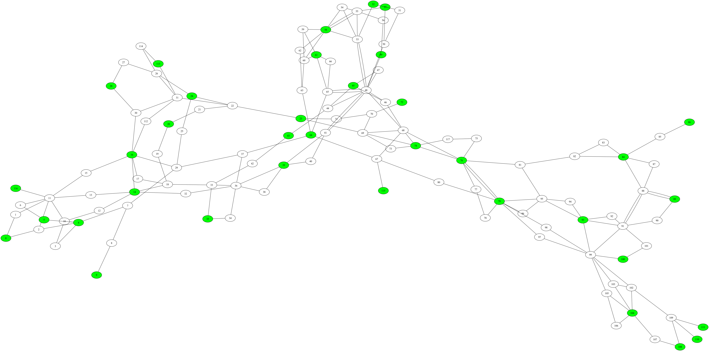

# Optimal PMU Placement for Power-System Observability


Heuristic PMU placement with zero-injection, current-channel, IEEE, and NCEII variants.



<p align="center"><sub>IEEE 118-bus example. Green nodes are PMU-equipped buses; indices are zero-based.</sub></p>

## Highlights

- Exact minimum-cardinality placement through `scipy.optimize.milp` for a base case with no zero-injection buses and no limits on the number of current phasor measurements per PMU
- PageRank Placement Algorithm (PPA) for fast construction of an observable solution
- Iterated Local Search (ILS) heuristic for minimizing the number of PMUs while maintaining full observability
- Observability rules for zero-injection buses
- Placement with a configurable number of current-measurement channels per PMU
- IEEE 14-, 57-, and 118-bus data, plus a 233-bus NCEII use case from the Czech Republic
- Graphviz network rendering and archived YAML results

## Problem formulation

The basic model treats the power network as an undirected graph. A PMU observes its own bus and every adjacent bus. If \(A\) is the adjacency matrix, \(I\) is the identity matrix, and \(x_i\in\{0,1\}\) indicates whether a PMU is installed at bus \(i\), the exact model implemented by `Graph.getPDS()` is

$$
\begin{aligned}
\min_x \quad & \sum_i x_i \\
\text{subject to} \quad & (A+I)x \geq \mathbf{1}, \\
& x_i \in \{0,1\}.
\end{aligned}
$$

The extended modules modify the observability rules to account for zero-injection buses and PMUs with a limited number of measured incident branches.

## Methods and variants

| Capability | Main modules | Purpose |
|---|---|---|
| Exact placement | `Graph.py` | Solves the binary covering model with SciPy MILP |
| PageRank placement | `pageRank.py`, `PMUconfiguration.py` | Builds an observable configuration from terminal buses and node importance |
| Iterated Local Search | `ILS.py`, `OptPlacementPMU.py` | Perturbs and improves a PPA starting solution |
| Zero-injection modeling | `Graph_zeroinjection.py`, `OptPlacementPMU_zeroinj.py` | Applies zero-injection observability propagation |
| Limited current channels | `Graph_constraint.py`, `PMUconfiguration_constr.py` | Selects both PMU buses and measured branches |
| NCEII 233-bus case | `Graph_NCEII.py`, `getinfoNCEII.py` | Runs the algorithms on the bundled 233-bus network |

## Quick start

### 1. Clone and create an environment

```bash
git clone https://github.com/mhurtgen/PMU.git
cd PMU

python -m venv .venv
source .venv/bin/activate       # Windows: .venv\Scripts\activate
python -m pip install --upgrade pip
python -m pip install numpy scipy pyyaml graphviz
```

The Python `graphviz` package is required by the current modules. Creating figures also requires the [Graphviz system application](https://graphviz.org/download/) so that the `dot`/`fdp` executables are available.

### 2. Solve the IEEE 14-bus case exactly

The following example uses files exactly where they are stored in the current repository:

```python
import pickle

from Graph import Graph
from PMUconfiguration import PMUconfiguration

with open("branchcase14.pickle", "rb") as stream:
    branches = pickle.load(stream)

grid = Graph(14, branches)
solution = PMUconfiguration(14)
solution.setPMUconfig(grid.getPDS())

print(f"PMUs ({solution.getnPMU()}): {solution.getPMUnodes()}")
print(f"Observable: {bool(grid.isobs(solution))}")
```

A typical result is:

```text
PMUs (4): [1, 6, 9, 12]
Observable: True
```

Equivalent four-PMU solutions may be returned depending on solver tie-breaking. All bus indices used by the algorithms and stored results are **zero-based**.

### 3. Run the heuristic

```python
import pickle

from OptPlacementPMU import OptPlacementPMU

with open("branchcase14.pickle", "rb") as stream:
    branches = pickle.load(stream)

optimizer = OptPlacementPMU(14, branches)

ppa_solution = optimizer.PPA()
print("PPA:", ppa_solution.getPMUnodes())

ils_solution = optimizer.ILS()
print("ILS:", ils_solution.getPMUnodes())
```

ILS is stochastic. Set both Python's and NumPy's seeds before a run when repeatability matters:

```python
import random
import numpy as np

random.seed(42)
np.random.seed(42)
```

## Bundled data and results

The root-level pickle files contain branch, bus, and generator data for the IEEE cases. `net_spec_for_PMUplacement.txt` and `net_spec_for_PMUplacement_respect_switches.txt` describe the 233-bus case; `getinfoNCEII.py` exposes its indexed branch list and zero-injection buses.

`Results.zip` contains saved YAML configurations. These are archived research outputs—not a claim that every configuration is globally optimal.

| Network | Standard observability | With zero injections |
|---:|---:|---:|
| IEEE 14 | 4 PMUs | 3 PMUs |
| IEEE 57 | 17 PMUs | 12 PMUs |
| IEEE 118 | 32 PMUs | 28 PMUs |
| NCEII 233 | 84 PMUs | No solution found |

Extract the archived outputs before using methods that read from `Results/` or write figures to `Figure/`:

```bash
unzip Results.zip
unzip Figure.zip
```

The example scripts in the repository predate the current flat data layout and refer to files under `Grids/`. Either update those paths to the root-level pickle files, as in the quick-start example, or create a `Grids/` directory and place the pickle files there.

## Repository guide

```text
.
├── Graph*.py                 # network models and observability rules
├── PMUconfiguration*.py      # PMU configurations and construction heuristics
├── ILS*.py                   # local-search implementations
├── OptPlacementPMU*.py       # high-level optimization workflows
├── pageRank.py               # PageRank calculation
├── branchcase*.pickle        # IEEE network topology
├── buscase*.pickle           # IEEE bus data
├── gencase*.pickle           # IEEE generator data
├── getinfoNCEII.py           # 233-bus NCEII topology
├── test*.py                  # exploratory experiment scripts
├── Results.zip               # archived YAML configurations
└── Figure.zip                # archived network visualizations
```

## Visualization

`Graph.representation(configuration)` renders a network with PMU buses highlighted in green. Create the output directory first:

```bash
mkdir -p Figure
```

```python
grid.representation(solution)
```

The zero-injection and constrained variants add their own visual encodings. Rendering uses Graphviz's force-directed `fdp` engine and writes files below `Figure/`.

## Research-code notes

This repository is an experimental codebase rather than an installable Python package. In particular:

- Scripts are intended to be run from the repository root.
- Several `test*.py` files are experiment drivers rather than automated unit tests.
- Heuristic runs print progress and can produce different valid configurations.
- Exported results and rendered figures expect `Results/` and `Figure/` to exist.
- Loading pickle files should only be done with data from a trusted source.

## Contributing

Issues and pull requests are welcome. Especially useful contributions include reproducible experiment commands, automated tests, dependency metadata, clearer separation of data and source code, and comparisons against published PMU-placement benchmarks.

## Citation

> M. Hurtgen and P. Praks. (2026). *PMU: Optimal PMU placement for power-system observability* [Computer software]. GitHub. https://github.com/mhurtgen/PMU

Citation metadata is also provided in [`CITATION.cff`](CITATION.cff).

## License

This repository is licensed under the [Creative Commons Attribution 4.0 International License](LICENSE).
